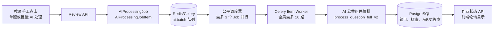
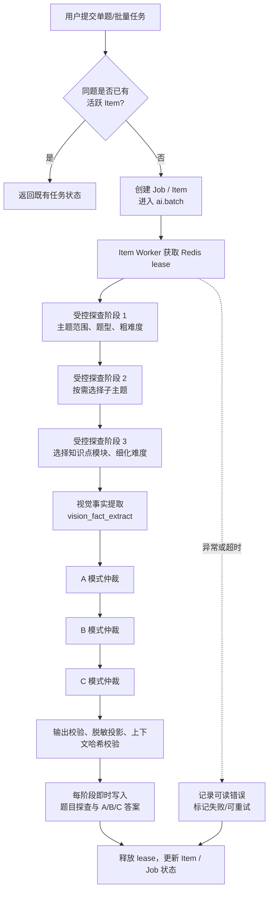
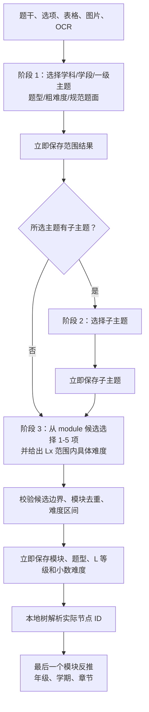
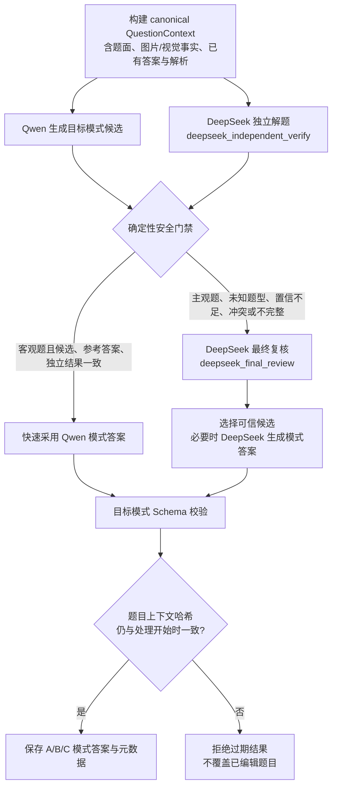
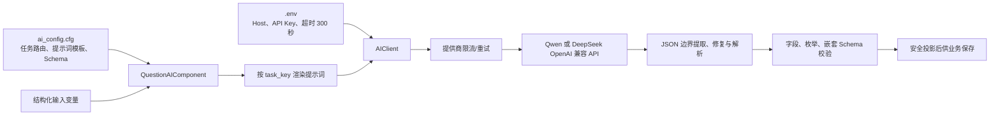

# AI 公共组件调用流程与接口契约

> 本文对应当前 `config/ai_config.cfg`、`apps/common/ai/` 及 `apps/review/` 的实现。配置中的 API 地址、密钥、模型名与超时只从 `.env` 读取；提示词和任务路由只从 `config/ai_config.cfg` 读取。本文不记录密钥，也不复制完整提示词正文。

## 1. 总览

所有题目 AI 功能均为**用户手工触发**：题库单题按钮、题库批量处理、课程练习单题“AI处理”和课程练习“批量AI处理”。系统不会在题目导入、编辑或定时任务中自动调用模型。



### 队列与并发边界

| 约束 | 当前值 | 作用 |
|---|---:|---|
| 排队容量 | 10,000 个 Item | 达到上限时拒绝新任务，避免 Redis/Celery 无限制堆积 |
| 同时活跃 Job | 3 | 让不同批次公平轮转，避免一个大批次长期独占 |
| 全局 AI Item 并发 | 6 | 同时执行的“题目全流程”上限 |
| 提供商限流 | 按 Qwen / DeepSeek 分别配置 | 防止超过模型侧并发或速率配额 |
| 单模式软/硬超时 | 3,800 / 3,900 秒 | 保障超长模型调用可被 Celery 回收 |
| Redis 任务锁 TTL | 4,200 秒 | 防重复执行；任务结束、入队失败均主动按 owner 原子释放 |

## 2. 题目全流程（AI 批量处理）

### 触发前提

- 当前用户具有该题的 AI 处理权限；课程练习题还需要满足课程共享范围权限。
- 题目记录存在；题干、选项、图片、表格、OCR/视觉识别结果会按实际可用情况纳入上下文。
- 用户点击“AI处理”或“批量AI处理”后，才创建任务；仅查询、保存题目不会触发。
- 同一题已有活跃任务时，后续请求复用/拒绝重复任务，不重复消耗模型调用。



> A、B、C 共享已完成的探查、知识点与视觉事实，避免对同一道题重复执行探查；每个模式自身仍进行独立的候选生成与验证。

## 3. 三阶段受控题目探查组件

探查由用户手工触发的全流程或“AI 探查”触发。目录已导入后，三次调用均使用 `qwen3.7-flash`，模型、路由、超时与提示词分别从 `.env` 和 `config/ai_config.cfg` 读取。模型只能从当前阶段提供的候选中选择，不能自由创造主题或知识点名称。

| 阶段 | 配置任务 | 模型输入 | 严格输出 | 即时写入 |
|---|---|---|---|---|
| 1：范围定位 | `controlled_taxonomy_scope` | 题干、选项、表格、可用图片、OCR/视觉事实，以及四个学科-学段范围内的一级主题候选 | `subject`、`stage`、`topic_id`、`question_type`、`difficulty_level`（L1-L5）、`normalized_text`、`confidence` | `ai_probe_result.taxonomy.scope`；更新题型、学科、粗难度 |
| 2：子主题定位 | `controlled_taxonomy_subtopic` | 规范题面、第一阶段结果、所选一级主题的子主题候选 | `subtopic_id`、`confidence`；没有子主题时本阶段跳过 | `ai_probe_result.taxonomy.subtopic` |
| 3：模块与细难度 | `controlled_taxonomy_knowledge` | 规范题面、已选主题路径、**叶子主题下的 `knowledge_points.module` 候选**、第一阶段难度等级 | `knowledge_modules`（1-5 个模块）、`difficulty_score`、`difficulty_reason`、`confidence` | `ai_probe_result.taxonomy.knowledge`、`ai_knowledge_enrichment`、题目知识点、`difficulty_level` 与 `difficulty` |

> 第三阶段候选粒度固定为 `knowledge_points.module`，本地约 470 个去重模块，而不是 2,000 多条细粒度记录。选中模块后，服务端再按“科目 + 学段 + 叶子章节 + module”解析实际 `KnowledgePoint` 节点 ID，继续使用既有 `ExamQuestion.knowledge_points = [{"id", "module"}]` 格式。因此题库知识树筛选、统计和历史接口均保持兼容。

第一阶段不会只取非空的父题干。对于“总题干 + 多个子题”、材料题和表格题，会把父题干、材料、完整选项、表格、全部子题、原学科和原题型组合为结构化题面后再交给模型，避免“请判断下列说法”这类通用父题干掩盖真实学科内容。第二阶段只在存在子主题候选时调用，此时模型必须从候选中选择一个有效 ID，不允许返回 `null`；候选为空则由后端直接记录跳过，不消耗模型调用。

受控目录导入时，章节与一级主题的匹配采用“更长关键词优先、同长度时章节中出现位置更靠前者优先、最后按配置顺序兜底”，不再使用第一个命中即停止。例如“第十三章 内能”的“内能”优先于力学中的宽泛关键词“能”，“第十八章 电功率”中的“电”优先于后出现的“力”。重复导入会删除受控主题下已经失效的动态章节叶子，防止同一章节同时残留在多个主题下。



### 3.1 难度与失败规则

- `difficulty_level` 与 `difficulty` 分开保存：例如 L3 对应 `difficulty_level="L3"`，具体数值只能是 3.00-3.90，如 3.20。
- 每阶段 JSON、候选边界或难度校验失败时，仅重试当前阶段一次；仍失败则保留前面已保存的阶段结果和失败原因，不清空任何成功数据。
- 一个题有多个模块时，按模型返回顺序保存；最后一个可解析模块所对应的本地节点反推年级、学期和章节。
- 历史数据或目录尚未导入的环境继续使用兼容探查路径；导入受控目录后，新的手工探查和补齐任务走三阶段流程。

## 4. A / B / C 模式答案：候选与仲裁

三个模式的可靠性流程一致，差异只在模式提示词、输出结构和展示目的。

| 模式 | 配置任务 | Qwen 目标输出 |
|---|---|---|
| A 模式 | `[task:mode_a_answer]` / `[prompt:mode_a_answer]` | 分步推理、最终答案、结论/说明；面向直接讲解 |
| B 模式 | `[task:mode_b_answer]` / `[prompt:mode_b_answer]` | 可交互的问题序列、每步参考回答、提示与目标答案；面向苏格拉底式引导 |
| C 模式 | `[task:mode_c_answer]` / `[prompt:mode_c_answer]` | 分层练习或追问内容、参考回答/评估点；面向扩展讨论 |

### 4.1 传给 Qwen 的内容

各模式组件都从同一份“规范题目上下文”构建输入，且按确定顺序保留完整选项：

```text
question_context_json
  - 题干、所有选项、题型、学科、年级/学期、章节
  - 图片、表格、图形与视觉识别事实（如有）
  - 已探查知识点及本地知识点引用
  - 题库已有答案、已有解析（如有）
normalized_text + 完整选项文本
vision_json
knowledge_refs
```

已有答案/解析只作为**核验依据和上下文事实**，不能绕过后续验证流程。

### 4.2 独立解题优先、冲突再综合复核



#### DeepSeek 阶段一：独立解题

| 项目 | 说明 |
|---|---|
| 配置任务 | `[task:deepseek_independent_verify]` / `[prompt:deepseek_independent_verify]` |
| 前提 | 已得到一个 Qwen 候选，且需要验证该模式的答案；在仲裁中作为独立证据执行 |
| 输入 | 仅“作答所需的题面事实”：题干、完整选项、图片/表格/视觉事实、题型/学科等属性、题库已有答案与已有解析；**不传入 Qwen 的候选答案** |
| 提示词目的 | 在避免锚定 Qwen 结果的前提下独立求解，并输出目标模式所需的结构化内容与可比较的结论 |
| 输出 | `mode_content`、可比较的最终结论、置信/依据及结构化核验字段 |

#### DeepSeek 阶段二：最终复核

| 项目 | 说明 |
|---|---|
| 配置任务 | `[task:deepseek_final_review]` / `[prompt:deepseek_final_review]` |
| 前提 | 三方结果不一致、主观/未知题型、置信不足、输出不完整或确定性门禁不能快速通过 |
| 输入 | 同一份题面事实 + Qwen 候选（匿名为 Candidate A）+ 独立解题结果（匿名为 Candidate B）+ 冲突摘要 + 目标模式 Schema |
| 提示词目的 | 对冲突证据重新判断；不得简单偏向候选标签；输出可直接通过目标模式 Schema 的最终结论/模式内容 |
| 输出 | 最终选用或重生成的 `mode_content`、最终答案、核验理由和置信字段 |

### 4.3 快速采用与复核条件

| 结果类型 | 是否可以不进入最终复核 | 规则 |
|---|---|---|
| 单选、多选、判断及已登记别名 | 可以 | Qwen、DeepSeek 独立结果、题库参考答案（如有）在可比较答案上相互一致，且模式结构通过校验 |
| 计算、填空、主观、未知题型 | 不可以 | 必须进入 DeepSeek 最终复核，避免仅凭字符串相似性误判 |
| 有参考答案但三方冲突 | 不可以 | 由最终复核综合题面事实和匿名候选；不以参考答案单独覆盖 |
| 无参考答案且 Qwen/独立结果不一致 | 不可以 | 由最终复核生成/选择可验证的目标模式答案 |
| 图片/视觉信息不足、输入不完整、Schema 不通过 | 不可以 | 进入复核或失败关闭，不保存伪完整答案 |

## 5. 通用调用协议

所有公共组件遵循相同的“配置—请求—解析—校验”约束。



### 调用保护

- 单次模型 HTTP 超时来自 `.env`，当前统一为 **300 秒**；Celery 外层另有更长的软/硬超时。
- 解析器只接受任务 Schema 对应的结构化 JSON；会处理模型在 JSON 后追加的半截结构，但不会把原始异常文本写入答案。
- 模型调用失败、权限/配置失败、响应不合规时，返回受控错误状态；不会保存部分或混合模式答案。
- A/B/C 结果写入前会校验题目上下文哈希，题目在处理期间被编辑时会丢弃旧结果。
- Redis 可用时，通过租约、Lua compare-and-delete 安全释放锁；Redis 临时不可用时使用进程内保守限流，仍保持失败关闭。

## 6. 其他已统一到公共组件的 AI 任务

| 业务能力 | 任务 / 提示词配置键 | 前提与主要输入 | 结构化输出 |
|---|---|---|---|
| 视觉事实提取 | `vision_fact_extract` | 题干、题图、表格、OCR | 图表文字、关系、视觉事实、置信度 |
| 试卷页面识别（遗留独立能力） | `vision_page_parse` | 页面图片/OCR | 页面区域、题目候选块 |
| 单题视觉识别（遗留独立能力） | `vision_question_parse` | 题目图片/OCR | 题干、选项、图表与题目结构 |
| 位置识别（遗留独立能力） | `vision_position_detect` | 页面图片、目标描述 | 目标区域坐标/置信度 |
| 学生引导生成 | `guidance_generate` | 题目、学生作答、会话阶段、知识点 | 追问、提示、下一步引导 |
| 学生/教师引导评价 | `guidance_evaluate`、`teacher_guidance_evaluate` | 对话历史、目标、评分维度 | 理解度、评价、改进建议 |
| 变式题生成与复核 | `variant_generate`、`variant_verify_deepseek` | 原题、知识点、难度、约束 | 变式题、答案、解析、复核结论 |
| 拍照题识别 | `photo_recognize` | 图片、OCR、上下文 | 识别题面及结构化题目字段 |
| 课程资料识别 | `course_material_recognize` | 上传资料图片/PDF OCR | 资料结构、章节/要点、可用文本 |
| 通用结果复核 | `result_verify` | 候选输出、任务上下文、规则 | 校验结论、冲突/修正建议 |

> “试卷解析”主业务入口、单页重解析、单题重解析的 Celery 任务已按产品决定删除。表中遗留视觉任务仅说明公共组件可承接的底层识别能力，不代表重新启用已删除的试卷解析功能。

## 7. 配置索引与维护方式

| 配置位置 | 负责内容 | 修改原则 |
|---|---|---|
| `.env` | API Host、API Key、数据库/Redis 连接、模型超时 | 仅运维配置；不提交密钥，不在业务代码硬编码 |
| `config/ai_config.cfg` 的 `[provider:*]` | 提供商、模型、路由、限流相关配置 | 统一更换模型或模型 URL 时在此处/环境配置调整 |
| `config/ai_config.cfg` 的 `[task:*]` | 每项任务的模型路由和输出约束 | 新增 AI 能力必须先登记 task key |
| `config/ai_config.cfg` 的 `[prompt:*]` | 提示词模板与变量占位符 | 提示词改变时须同步 Schema 测试，避免只改文案破坏输出 |
| `apps/common/ai/schemas.py` | 探查、A/B/C、复核等输出 Schema | 新字段先定义 Schema，再修改提示词和保存逻辑 |

### 建议的变更检查顺序

1. 明确是否属于用户手工触发功能，避免恢复自动 AI 调用。
2. 在 `ai_config.cfg` 定义任务、提示词变量和模型路由。
3. 在公共组件定义输入构建、Schema 与失败关闭策略。
4. 为 Qwen、DeepSeek 独立解题、最终复核分别加入 mock 回归用例。
5. 验证单题、批量、重复点击、任务取消/重试、题目处理中被编辑等边界。
6. 不记录或输出 API Key、原始模型响应和包含个人信息的题面日志。
